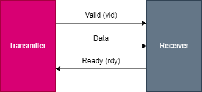

# FIFO interface (ready/valid)

## The FIFO interface



Data is the wire that actually passes data from the transmitter to the Receiver. 

Valid and Ready are known as handshaking signals which allow the Transmitter and the Receiver to communicate with regards to when it is time to pass the data.

The Valid signal (output from the Transmitter and input to the Receiver) indicates that the Transmitter has put valid data on the Data line *this* cycle.

The Ready signal (output from the Receiver and input to the Transmitter) indicates that the Receiver is ready to receive new data. Ready can be asserted as soon as the Receiver is ready to receive new data.

## State machine


This state machine indicates once the transmitter assert the `vld` or the receiver assert the `rdy` signal, these signals must hold until their counterpart assert

## The handshake and data transfer

The FIFO Interface handshake ensures that data passes from the source to the sink only when the source has valid data to pass and when the sink is ready to receive that data.


### Example waveform explanation


The positive clock edge marked with arrow indicating the transfer of the data is made (i.e. the handshake occurs) at the beginning of clock cycle 3, 5, 6 and 7 as demonstrated in Figure 1

## Sample code snippet and sample waveform

### Transmitter

```verilog
module transmitter(
  input clk,
  input rst_n,
  output vld,
  output [7:0] data,
  input rdy
);
  reg next_vld;
  reg [7:0] next_data;
  reg [7:0] hold_data;
  reg reg_vld;
  reg [7:0] reg_data;

  logic [7:0] sent_data[$];
  
  typedef enum {IDLE, WAIT_RDY, WAIT_VLD, TRANSFER} ff_state;

  ff_state current_state = IDLE;
  ff_state next_state    = IDLE;
  
  always @(*) begin
    case (current_state)
      IDLE: begin
        if (reg_vld == 1 && rdy == 0) begin
          next_state = WAIT_RDY;
        end else if (reg_vld == 0 && rdy == 1) begin
          next_state = WAIT_VLD;
        end else if (reg_vld == 1 && rdy == 1) begin
          next_state = TRANSFER;  
        end else begin
          next_state = current_state;
        end
      end
      
      WAIT_RDY: begin
        if (reg_vld == 1 && rdy == 1) begin
          next_state = TRANSFER;  
        end else begin
          next_state = current_state;
        end
      end
      
      WAIT_VLD: begin
        if (reg_vld == 1 && rdy == 1) begin
          next_state = TRANSFER;  
        end else begin
          next_state = current_state;
        end
        
      end
      
      TRANSFER: begin
        if (reg_vld == 1 && rdy == 0) begin
          next_state = WAIT_RDY;
        end else if (reg_vld == 0 && rdy == 1) begin
          next_state = WAIT_VLD;
        end else if (reg_vld == 0 && rdy == 0) begin
          next_state = IDLE;  
        end else begin
          next_state = current_state;
        end
        
      end
      
    endcase
    
  end
  
  always @(posedge clk or negedge rst_n) begin
    
    // Next state here is the previous state from the previous cycle
    $display("[DEBUG %d] next_vld: %d, next_state: %d, current_state: %d", $time, next_vld, next_state, current_state);
    
    if (!rst_n) begin
      current_state <= IDLE;
      reg_vld <= 0;
      reg_data <= 0;
    end else begin
      current_state <= next_state;
      
      next_vld = $urandom;
      
      if (next_vld == 1 && next_state != WAIT_RDY) begin
        // Send next_data on the next cycle
        next_data = $urandom_range(1,10);
        hold_data = next_data;
        sent_data.push_back(next_data);
      end else if (next_state == WAIT_RDY) begin
        next_data = hold_data;
      end else begin
        next_data = 0;
      end
      
      reg_vld <= #0.1 (next_state == WAIT_RDY) ? 1 : next_vld;
      reg_data <= #0.1 next_data;
    end
  end
  
  assign vld = reg_vld;
  assign data = reg_data;
endmodule
```

### Receiver

```verilog
module receiver(
  input clk,
  input rst_n,
  input vld,
  input [7:0] data,
  output rdy
);
  reg next_rdy;

  reg reg_rdy;

  logic [7:0] received_data[$];
  
  reg no_random = 0;
  
  typedef enum {IDLE, WAIT_RDY, WAIT_VLD, TRANSFER} ff_state;

  ff_state current_state = IDLE;
  ff_state next_state    = IDLE;
  
  always @(*) begin
    case (current_state)
      IDLE: begin
      	no_random = 0;
        
        if (reg_rdy == 1 && vld == 0) begin
          next_state = WAIT_VLD;
        end else if (reg_rdy == 0 && vld == 1) begin
          next_state = WAIT_RDY;
        end else if (reg_rdy == 1 && vld == 1) begin
          next_state = TRANSFER;  
        end else begin
          next_state = current_state;
        end
      end
      
      WAIT_VLD: begin
        no_random = 1;
        if (reg_rdy == 1 && vld == 1) begin
          next_state = TRANSFER;  
        end else begin
          next_state = current_state;
        end
      end
      
      WAIT_RDY: begin
		no_random = 0;
        if (reg_rdy == 1 && vld == 1) begin
          next_state = TRANSFER;  
        end else begin
          next_state = current_state;
        end
        
      end
      
      TRANSFER: begin
        
        if (reg_rdy == 1 && vld == 0) begin
          next_state = WAIT_VLD;
        end else if (reg_rdy == 0 && vld == 1) begin
          next_state = WAIT_RDY;
        end else if (reg_rdy == 0 && vld == 0) begin
          next_state = IDLE;
        end else begin
          next_state = current_state;
        end
        
      end
      
    endcase
    
  end
  
  always @(posedge clk or negedge rst_n) begin
    $display("[DEBUG %d] current data: %d, current_state: %d, next_state: %d", $time, data, current_state, next_state);
    
    if (next_state == TRANSFER) begin
      // Sample the data
      $display("[DEBUG %0t] pushing %d data value", $time, data);
      received_data.push_back(data);
    end
    
    
    if (!rst_n) begin
      reg_rdy <= 0;
      current_state <= #0.1 IDLE;
    end else begin
      reg_rdy <= #0.1 (next_state == WAIT_VLD) ? 1 : $urandom;
      current_state <= #0.1 next_state;
    end
  end
  
  assign rdy = reg_rdy;
endmodule
```

### Testbench

```verilog
module test_top;
  reg _clk;
  reg _rst_n;
  
  wire [7:0] _data;
  wire _vld;
  wire _rdy;
  
  transmitter tx(_clk, _rst_n, _vld, _data, _rdy);
  receiver rx(_clk, _rst_n, _vld, _data, _rdy);
  
  initial begin
  	$dumpfile("dump.vcd");
    $dumpvars(0);
    
    _clk = 0;
    _rst_n = 1;
    
    #10ns;
    
    _rst_n = 0;
    
    #10ns;
    
    _rst_n = 1;
    
    #1000ns;
        
    foreach (rx.received_data[i]) begin
      $display("[DEBUG] RX RECEIVED %d: %d", i, rx.received_data[i]);
  	end
    
    foreach (tx.sent_data[i]) begin
      $display("[DEBUG] TX SENT %d: %d", i, tx.sent_data[i]);
  	end
    
    $finish;

  end
  
  always #10ns _clk = ~_clk;
endmodule
```

### Sample waveform


## References
- Drake, C. (2020, August 3). Ready/Valid Protocol Primer. Drake Enterprises. http://www.cjdrake.com/readyvalid-protocol-primer.html
- W. Fletcher, C. (2009). EECS150: Interfaces: “FIFO” (a.k.a. Ready/Valid) (B). https://inst.eecs.berkeley.edu/~cs150/Documents/Interfaces.pdf